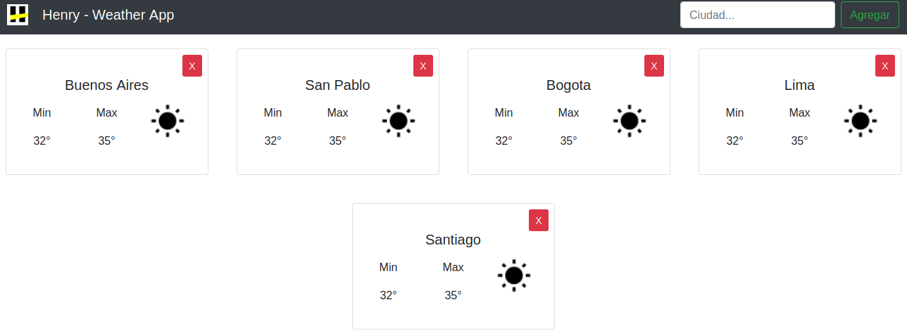

## Henry Weather

### Instrucciones para correr el proyecto

Desde la carpeta raíz "weather-react" se pueden ejecutar los siguientes comandos:

#### `npm start`

Comienza a correr la aplicación de forma local por lo que se puede ver desde el navegador accediendo a
http://localhost:3000

No es necesario volver a correr el proyecto cada vez que se realice un cambio sino que se verá automáticamente reflejando en el navegador.

#### `npm test`

Ejecuta los tests indicando el resultado de cada uno de ellos por consola. Para más información sobre este tema se puede consultar el siguiente link: [running tests](https://facebook.github.io/create-react-app/docs/running-tests)

### Ejercitación

#### Título

1. Cambie el nombre actual del título por "Henry - Weather App"

2. Centrar el título utilizando el archivo "App.css"

#### Barra de búsqueda

4. Crear una carpeta llamada "componentes" dentro de la carpeta "src"

3. Crear un componente denominado "Busqueda" que va a utilizarse para luego poder encontrar las ciudades sobre las cuales se desee ver el clima actual. Para ello deberán crearse dentro de la carpeta de "componentes" los siguientes dos archivos:
  * Busqueda.js
  * Busqueda.css

4. Crear una barra de navegación en la cual se incluya el logo de "Henry" (Pueden encontrarlo en la carpeta "public"), el título previamente definido y un cuadro de búsqueda. La página final hasta este momento debería quedar similar a la siguiente:

Ayuda *: Recordar de importar el nuevo componente en el archivo "App.js" para poder utilizarlo desde allí*

#### Tarjeta de clima

5. Crear otro componente dentro de la carpeta "Componentes" denominado "Tarjeta" que va a utilizarse para mostrar el clima actual en alguna ciudad elegida

6. Agregar tres tarjetas de prueba para ver como quedarían en pantalla. Las mismas deben estar centradas. Debería verse similar a lo siguiente:

*Luego estas tarjetas se irán agregando dinámicamente*

#### Tablero general

7. Para poder agrupar las tarjetas y facilitar luego la carga dinámica de las mismas es recomendable agruparlas dentro de un componente superior al que denominaremos "Tablero". Crearlo y asignarle un array con nombres de ciudades dentro del estado de dicho componente

*Por el momento utilizar de ejemplo los nombres que quieran, podrían ser: Buenos Aires, San Pablo, Bogota, Lima, Santiago*

8. Implementar un método dentro del componente de Tablero para renderizar una Tarjeta por cada elemento definido en el Array de ciudades. Debería quedar algo similar a lo siguiente:

Ayuda *: para poder asignarle el nombre de la ciudad correspondiente a cada Tarjeta va a ser necesario pasárselo como propiedad y modificar el archivo "Tarjeta.js" para que utilice dicho valor*

#### Adición/Eliminación dinámicamente

9. Ahora queremos que las tarjetas se agreguen mediante el botón "Agregar" de la barra de búsqueda por lo que es necesario crear un método que sea invocado al hacer click en dicho botón y que cree una nueva tarjeta.

*Por el momento la crearemos únicamente con el nombre de la ciudad buscada sin tomar en consideración la temperatura ya que ello se pedirá más adelante*

Ayuda *: La App va a ser quien deberá contener los datos de las tarjetas a renderizar y pasárselos al componente Tablero como una propiedad. Para ello recordar como utilizar las funciones de callback entre componentes*

  

10. Implementar un método para remover las tarjetas que ya se encuentran agregadas al Tablero, el mismo se debe ejecutar al hacer click en la cruz roja de la parte superior derecha de cada Tarjeta

  

#### Obtención de los datos del clima desde OpenWeatherMap API

Hasta ahora los datos de la temperatura los estábamos poniendo arbitrariamente en un valor determinado pero ahora queremos obtener dichos datos desde una API gratuita denominada ["OpenWeatherMap"](https://openweathermap.org/current). En el link encontrarán la documentación asociada para que desde la aplicación de React hagan llamados a ella para obtener los datos necesarios. Para poder utilizarla van a tener que registrarse para obtener una API KEY la cual va a ser necesaria como parámetro del request a la API para poder obtener una respuesta válida.

IMPORTANTE*: Si bien estamos construyendo una aplicación simple, es importante que sepan que no es una buena práctica exponer las claves al público en general por lo que si están subiendo el código a un repositorio público de Github sería bueno que vean este [tutorial](http://lortza.github.io/2018/05/22/create-react-app-api-keys.html) en el cual les muestran como guardar la clave en una variable de entorno y evitar exponerla públicamente*

11. Realizar una llamada a la API cuando se haga click en el botón de "Agregar" y obtener los datos de la ciudad buscada. En el caso de que no se encuentre la ciudad mostrar una alerta.

12. Una vez obtenidos los datos observar que dentro del JSON provisto en el apartado "Main" van a encontrar los datos de la temperatura mínima y máxima. Agregar dichos valores redondeados matemáticamente junto con el nombre de la ciudad a la tarjeta que se va a incorporar al tablero.

Ayuda *: La App va a tener que guardar en su estado el array con objetos que contengan ahora aparte del nombre, las temperaturas máximas y minimas.*

13. [OPCIONAL] Modificar el ícono de la tajeta y colocar el que corresponda. Para ello es necesario obtener el código del ícono del JSON y luego obtenerlo desde http://openweathermap.org/img/wn/{codigo}@2x.png

*Por ejemplo para el código "10d" sería http://openweathermap.org/img/wn/10d@2x.png*

